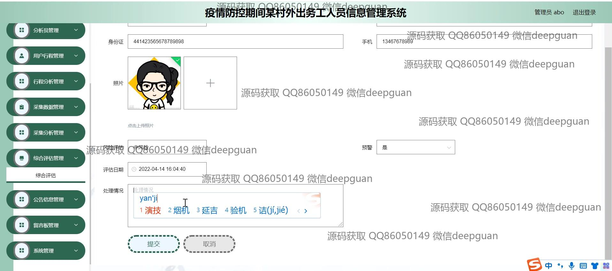
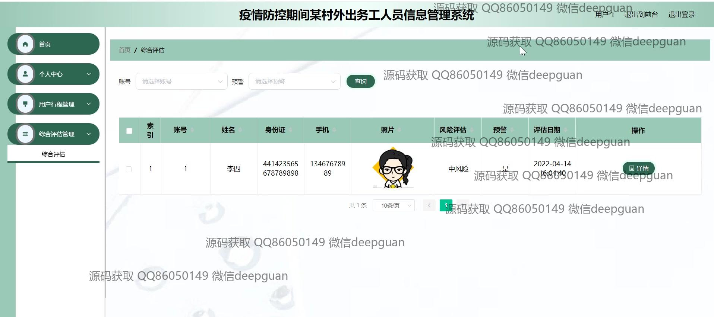

<h1 align="center">疫情防控期间某村外出务工人员信息管理系统</h1>

## 简介
疫情防控期间某村外出务工人员信息管理系统：支持管理员、采集员、分析员等角色，提供人员信息管理、行程记录与分析、风险评估和用户注册功能，旨在提升疫情期间的信息管理与防控能力。    --计算机毕业设计源码；毕设源码；java毕业设计源码

## 联系方式

<h3 align="center">获取完整代码与数据库文件 + 微信：deepguan QQ: 86050149 QQ群: 783742310</h3>

<h3 align="center">可帮忙远程部署 包运行成功！提供远程部署、修改代码、设计文档指导、代码讲解等服务！</h3>

## 功能介绍（完整见运行截图）
管理员：管理外出务工人员信息系统的登录、注册和退出功能。可查看和修改用户信息，包括姓名、身份证、联系方式、照片等。管理系统涵盖的模块有首页、个人中心、用户管理、采集员管理、和分析员管理等。支持用户行程管理、行程分析、风险评估以及综合评估管理。可对人员信息进行录入、修改、审核和删除。提供公告信息、疫情资讯、和留言板管理功能。进行风险评估及处置，导出数据，实现用户权限管理和角色分配功能。

采集员：负责录入采集数据，如身份信息、联系方式和行程码。上传相关文件如照片、核酸码和行程码，并记录采集日期和外出地点。可访问个人中心查看个人信息，并参考公告信息和疫情资讯。协助进行人员管理和行程信息更新，确保相关信息的准确性和及时性。

分析员：执行信息分析和风险评估，选择和记录风险等级。管理分析结果，包括风险评估和预警报告。可以访问用户行程管理、综合评估管理和采集数据管理功能模块，确保外出务工人员信息的全面管理和准确追踪。能查看和管理个人信息、疫情资讯及系统内的相关公告。

普通用户：注册、登录和退出系统，访问个人中心以查看和更新自己的基本信息，如姓名、身份证、联系信息等。提交和查看行程记录和风险评估情况。可以上传照片、核酸码和行程码，保持个人和行程信息的最新更新。查看公告和疫情相关资讯，以便做出及时调整和决策。

## 运行截图

本代码来源于网络,仅供学习参考使用!

